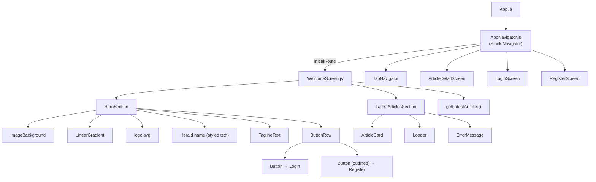

# Design Document: Mobile Landing Welcome Screen

## Overview

The WelcomeScreen is the initial route in the La Verdad Herald React Native app's navigation stack. It mirrors the web `LandingPage.jsx` — presenting a full-screen hero with background image, gradient overlay, branding elements, and Login/Sign Up buttons, followed by a scrollable latest articles section. The screen is unauthenticated and visible to all users on first launch.

The implementation reuses existing mobile components (`ArticleCard`, `Button`, `Loader`, `ErrorMessage`) and follows the established style system (`colors.js`, `typography.js`). Navigation is handled via `@react-navigation/stack` already present in `AppNavigator.js`.

---

## Architecture



**Key architectural decisions:**

- WelcomeScreen is inserted as the first `Stack.Screen` in `AppNavigator`, before `Main` (TabNavigator). This requires no auth state — it is always the entry point.
- `expo-linear-gradient` is used for the gradient overlay (standard in Expo projects). If not installed, a semi-transparent `View` fallback is used.
- The herald wordmark SVG (`la verdad herald.svg`) is not guaranteed to be in mobile assets, so the design uses styled `Text` as the primary approach (no SVG dependency).
- `ScrollView` wraps both sections. The hero uses `useWindowDimensions` to set `minHeight` equal to the screen height, ensuring it fills the viewport before scrolling.
- Article fetching uses the existing `getLatestArticles()` from `articleService.js`.

---

## Components and Interfaces

### WelcomeScreen

**File:** `mobile/src/screens/auth/WelcomeScreen.js`

**Props:** `{ navigation }` — standard React Navigation stack prop.

**State:**
```js
articles: Article[]       // fetched latest articles
loading: boolean          // true while fetching
error: string | null      // error message if fetch fails
```

**Responsibilities:**
- Renders `ScrollView` containing `HeroSection` and `LatestArticlesSection`
- Fetches latest articles on mount via `getLatestArticles()`
- Passes `navigation` callbacks to buttons and article cards

---

### HeroSection (inline within WelcomeScreen)

Rendered as a `View` with `minHeight = screenHeight`. Contains:

| Layer | Component | Notes |
|---|---|---|
| Background | `ImageBackground` | `source={require('../../../assets/bg.jpg')}` |
| Gradient | `LinearGradient` (expo-linear-gradient) | `colors: ['rgba(18,94,124,0.5)', 'rgba(0,0,0,0.7)']`, `start/end: top→bottom` |
| Logo | `Image` | `source={require('../../../assets/logo.svg')}` via `expo-asset` |
| Herald name | `Text` | Styled serif, white, large — fallback for missing SVG wordmark |
| Tagline | `Text` | Gray-300 equivalent, centered |
| Button row | `View` (row) | Login `Button` + Sign Up outlined `Button` |

---

### LatestArticlesSection (inline within WelcomeScreen)

Rendered as a `View` below the hero. Contains:

- Section heading `Text` ("Latest Articles")
- Conditional render: `Loader` while loading, `ErrorMessage` on error, or list of `ArticleCard` components
- Each `ArticleCard` receives `article` and `onPress` → `navigation.navigate('ArticleDetail', { id, slug })`

---

### Button (existing — `mobile/src/components/common/Button.js`)

Used as-is. The Sign Up button uses an `outlined` style variant. Since the existing `Button` component doesn't have an outlined variant, WelcomeScreen passes a custom `style` and `textStyle` prop to override appearance (white border, transparent background, white text).

---

### AppNavigator changes

**File:** `mobile/src/navigation/AppNavigator.js`

Add `WelcomeScreen` import and insert it as the first `Stack.Screen`:

```js
import WelcomeScreen from '../screens/auth/WelcomeScreen';

// Inside Stack.Navigator:
<Stack.Screen name="Welcome" component={WelcomeScreen} />
<Stack.Screen name="Main" component={TabNavigator} />
// ... existing screens
```

`RegisterScreen` must also be added to the stack (or confirmed present) so `navigation.navigate('Register')` resolves.

---

## Data Models

### Article (from existing API)

The `getLatestArticles()` call returns the same shape used throughout the app:

```ts
interface Article {
  id: number;
  slug: string;
  title: string;
  featured_image: string | null;
  published_at: string | null;
  author_name?: string;
  author?: { user: { name: string } };
  categories?: Array<{ id: number; name: string }>;
}
```

This is the same shape consumed by `ArticleCard` in `HomeScreen`, so no transformation is needed.

### Screen State

```ts
interface WelcomeScreenState {
  articles: Article[];
  loading: boolean;
  error: string | null;
}
```

### Asset References

| Asset | Path | Notes |
|---|---|---|
| Background image | `mobile/assets/bg.jpg` | Must be copied from `frontend/src/assets/images/bg.jpg` |
| Logo | `mobile/assets/logo.svg` | Already present |
| Herald wordmark | N/A | Rendered as styled `Text` (no SVG dependency) |

---

## Correctness Properties

*A property is a characteristic or behavior that should hold true across all valid executions of a system — essentially, a formal statement about what the system should do. Properties serve as the bridge between human-readable specifications and machine-verifiable correctness guarantees.*

### Property 1: WelcomeScreen is the initial route

*For any* app launch, the first screen rendered by `AppNavigator` should be `WelcomeScreen` (i.e., the route named `"Welcome"` is the initial route in the stack).

**Validates: Requirements 1.1, 1.2**

---

### Property 2: Hero branding elements are always present

*For any* render of `WelcomeScreen`, the hero section should contain the logo image, the herald name text, and the tagline text — regardless of network state or article loading state.

**Validates: Requirements 2.3, 2.4, 2.5, 2.6**

---

### Property 3: Login button navigates to Login screen

*For any* `WelcomeScreen` instance, tapping the Login button should trigger navigation to the `"Login"` route.

**Validates: Requirements 3.2**

---

### Property 4: Sign Up button navigates to Register screen

*For any* `WelcomeScreen` instance, tapping the Sign Up button should trigger navigation to the `"Register"` route.

**Validates: Requirements 3.3**

---

### Property 5: Article fetch populates the list

*For any* successful response from `getLatestArticles()`, the rendered `LatestArticlesSection` should contain exactly as many `ArticleCard` elements as articles returned by the API.

**Validates: Requirements 4.2, 4.3**

---

### Property 6: Loading state is shown while fetching

*For any* `WelcomeScreen` render where the articles fetch is in-flight, the `Loader` component should be visible and no `ArticleCard` elements should be rendered.

**Validates: Requirements 4.5**

---

### Property 7: Error state is shown on fetch failure

*For any* `WelcomeScreen` render where `getLatestArticles()` rejects, the `ErrorMessage` component should be visible and no `ArticleCard` elements should be rendered.

**Validates: Requirements 4.6**

---

### Property 8: ArticleCard tap navigates to ArticleDetail with correct params

*For any* article in the latest articles list, tapping its `ArticleCard` should navigate to `"ArticleDetail"` with `{ id: article.id, slug: article.slug }`.

**Validates: Requirements 4.4**

---

## Error Handling

| Scenario | Handling |
|---|---|
| `getLatestArticles()` network failure | Set `error` state; render `<ErrorMessage>` in articles section |
| `getLatestArticles()` returns empty array | Render a "No articles available" empty state text |
| `bg.jpg` asset missing | React Native will throw at bundle time; asset must be present before build |
| `logo.svg` asset missing | React Native will throw at bundle time; asset must be present before build |
| `expo-linear-gradient` not installed | Fallback: semi-transparent `View` with `backgroundColor: 'rgba(0,0,0,0.5)'` |
| Navigation to `Register` screen not in stack | `navigation.navigate('Register')` will throw; `RegisterScreen` must be added to `AppNavigator` |

---

## Testing Strategy

### Unit Tests

Focus on specific examples and edge cases:

- Render test: `WelcomeScreen` renders hero branding elements (logo, herald name, tagline) when mounted
- Render test: `WelcomeScreen` shows `Loader` while `getLatestArticles` is pending
- Render test: `WelcomeScreen` shows `ErrorMessage` when `getLatestArticles` rejects
- Render test: `WelcomeScreen` renders correct number of `ArticleCard` components on success
- Example test: tapping Login button calls `navigation.navigate('Login')`
- Example test: tapping Sign Up button calls `navigation.navigate('Register')`
- Example test: tapping an `ArticleCard` calls `navigation.navigate('ArticleDetail', { id, slug })`
- Edge case: `getLatestArticles` returns empty array → renders empty state, no `ArticleCard`

### Property-Based Tests

Use a property-based testing library (e.g., `fast-check` for JavaScript/TypeScript).

Each property test runs a minimum of **100 iterations**.

Each test is tagged with a comment in the format:
`// Feature: mobile-landing-welcome-screen, Property {N}: {property_text}`

| Property | Test Description | PBT Pattern |
|---|---|---|
| P2: Hero branding always present | For any article list (including empty, large), hero elements are always rendered | Invariant |
| P5: Article fetch populates list | For any array of N articles returned, exactly N `ArticleCard` elements render | Round-trip / Invariant |
| P6: Loading state exclusivity | For any in-flight fetch state, `Loader` is visible and `ArticleCard` count is 0 | Invariant |
| P7: Error state exclusivity | For any error string, `ErrorMessage` is visible and `ArticleCard` count is 0 | Invariant |
| P8: ArticleCard navigation params | For any article `{ id, slug }`, tapping its card passes exactly those params to navigation | Round-trip |

**Property test configuration example (fast-check):**

```js
// Feature: mobile-landing-welcome-screen, Property 5: Article fetch populates the list
it('renders exactly N ArticleCards for N articles returned', () => {
  fc.assert(
    fc.property(fc.array(articleArbitrary, { minLength: 0, maxLength: 20 }), (articles) => {
      // mock getLatestArticles to resolve with articles
      // render WelcomeScreen
      // assert ArticleCard count === articles.length
    }),
    { numRuns: 100 }
  );
});
```
